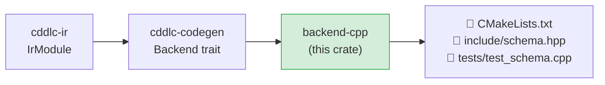

# backend-cpp

Generates a complete C++17 library — `CMakeLists.txt`, a header/implementation pair,
and a Catch2 test suite — from an `IrModule`.  The generated code uses modern C++17
features (`std::optional`, `std::variant`, `std::string_view`) and wraps the `nanocbor`
C runtime for CBOR I/O.

## Position in the pipeline



## Generated output layout

```
<output>/
  CMakeLists.txt           # CMake build definition, fetches nanocbor + Catch2
  include/
    <module>.hpp           # all types with encode/decode (header-only)
  tests/
    test_<module>.cpp      # Catch2 roundtrip tests
```

## Runtime

The C++ backend uses **nanocbor** for CBOR encoding and decoding (the same runtime as the
C backend's `nanocbor` mode).  The nanocbor C API is wrapped in RAII-friendly C++ helpers;
callers supply pre-allocated byte buffers and never touch `nanocbor_encoder_t` directly.

## What is generated per IR type

### Structs

```cpp
struct Device {
    std::string                id;
    bool                       active;
    std::optional<std::string> label;   // optional field

    bool encode(uint8_t* buf, size_t len, size_t& written) const;
    static std::optional<Device> decode(const uint8_t* buf, size_t len);
};
```

- `std::optional<T>` for optional fields.
- `std::string` for `tstr`; `std::vector<uint8_t>` for `bstr`.
- Arrays are `std::array<T, N>` (stack) or `std::vector<T>` (heap).

### Enums

```cpp
enum class Status { Ok, Warn, Error };

bool status_encode(Status v, uint8_t* buf, size_t len, size_t& written);
std::optional<Status> status_decode(const uint8_t* buf, size_t len);
```

### Type aliases

```cpp
using DeviceId = std::string;    // transparent alias
```

## Allocation strategy

| `--alloc` | Arrays use |
|---|---|
| `stack` (default) | `std::array<T, N>` — compile-time fixed capacity |
| `heap` | `std::vector<T>` — dynamic allocation |

## dCBOR support

When `--dcbor` is set, struct encode methods sort map entries by CBOR key before writing,
producing deterministic output per RFC 8949 §4.2.

## Build the generated code

```bash
cd <output>/
mkdir build && cd build
cmake .. -DCMAKE_BUILD_TYPE=Release -DCMAKE_CXX_STANDARD=17
make
ctest --output-on-failure
```

Requires a C++17-capable compiler (GCC 7+, Clang 5+, MSVC 2017+).

## Known gaps and future enhancements

- **JSON mode not available**: like the C backend, only CBOR output is generated.
- **nanocbor only**: the `--runtime` flag is accepted but only nanocbor is wired up.
- **Mixed-type enum decode**: mixed-type CDDL enums (string + integer variants) use
  `std::variant<…>` but the decode path does not yet handle all combinations robustly.
- **Header-only but large**: all types and implementations are in `.hpp`; splitting into
  `.hpp` + `.cpp` would reduce compile times for large schemas.
- **C++20 improvements**: the generated code targets C++17; `std::span`, Concepts, and
  `std::format` could improve the public API in C++20 mode.
- **Partial constraint validation**: `.regexp` constraints require a user `@regex-hook`.
- **No `@doc` as Doxygen comments**: doc pragmas are not rendered in the generated header.

## License

MIT OR Apache-2.0
